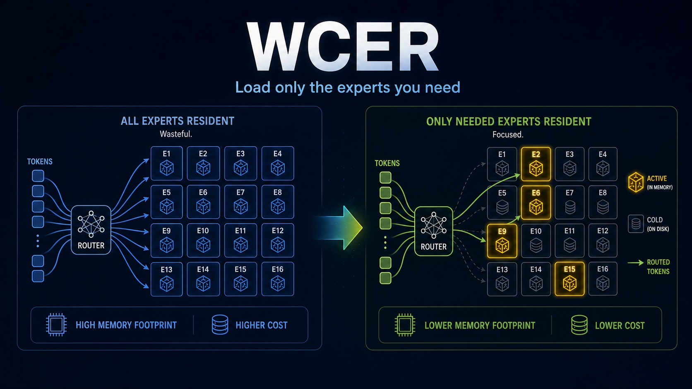
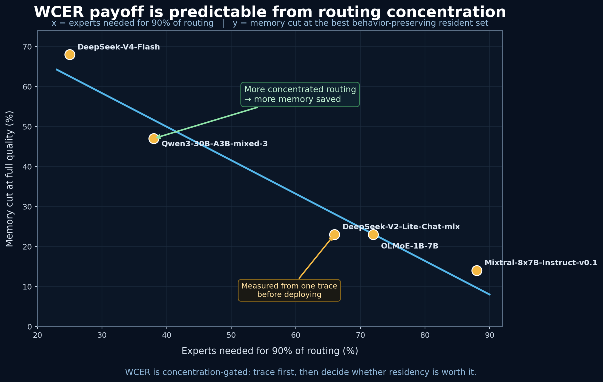

# WCER — Workload-Conditioned Expert Residency



**Run a Mixture-of-Experts (MoE) model using only the experts your workload actually uses — saving memory and start-up latency without changing the model's answers.**

WCER traces which experts a real workload activates, keeps only those resident in memory (the rest stay cold), restricts routing to that set, and verifies the slimmed model is **behavior-identical** to the full model under the same routing mask. How much it helps is set by how *concentrated* the model's routing is — which you can measure from a quick trace **before** deploying.

Validated on **5 MoE models from 4 families** (Mixtral, OLMoE, Qwen3, DeepSeek-V2-Lite, DeepSeek-V4-Flash), 4-bit, on Apple Silicon (MLX).

- **Read first:** [`WCER_DRAFT.md`](WCER_DRAFT.md) — plain-English explainer, use cases, findings.
- **Numbers + commands:** [`RESULTS.md`](RESULTS.md) — every headline number and how it was produced.

> **mechanism** = the scripts · **proof** = `traces/` + `RESULTS.md` · **interpretation** = `WCER_DRAFT.md` · **upstream changes** = `patches/`

## Visual summary




---

## Layout

```
wcer/
  WCER_DRAFT.md      # the writeup (start here)
  RESULTS.md         # headline numbers + the exact command behind each
  expert_trace.py            # 1. trace which experts each token selects
  expert_trace_compare.py    # 2. is routing workload-conditioned?
  expert_resident_manifest.py# 3. build a per-layer resident set ("bank")
  expert_resident_eval.py    # 4. router-masked quality eval (full weights)
  expert_resident_load.py    # 5. load ONLY resident experts; measure RAM/TTFT
  wcer_search.py             # hardware-fit search: budget × selection → Pareto
  traces/            # expert-trace/1 JSON artifacts (5 models × 3 workloads)
  patches/           # PR-ready mlx-lm patches (DeepSeek MoEGate hooks)
  figures/           # rendered figures + chart render script
```

## Install

```bash
pip install -r requirements.txt          # mlx, mlx-lm, numpy
```

Most models run unmodified. **DeepSeek** models need the two small patches in `patches/` (a ~6-line opt-in `_resident_mask` hook on each `MoEGate`, default off):

```bash
git -C "$MLX_LM" am /path/to/wcer/patches/*.patch     # $MLX_LM = your mlx-lm checkout
```

Run the scripts with that mlx-lm on `PYTHONPATH`:

```bash
export MLX_LM=/path/to/mlx-lm
```

## Quick start

```bash
# 0) sanity (no model download)
PYTHONPATH=$MLX_LM python expert_trace.py --self-test
PYTHONPATH=$MLX_LM python expert_resident_load.py --mode self-test-v4

# 1) trace which experts each workload uses (prefill; load once, all workloads)
PYTHONPATH=$MLX_LM python expert_trace.py \
    --model mlx-community/Qwen3-30B-A3B-mixed-3-4bit \
    --all-workloads --prefill-only --capture-weights --out-dir traces/

# 2) is routing workload-conditioned?
PYTHONPATH=$MLX_LM python expert_trace_compare.py --budget-frac 0.5 \
    traces/Qwen3-30B-A3B-mixed-3-4bit-trace-{general,code,math}.json

# 3) hardware-fit search → Pareto (RAM / quality / TTFT)
PYTHONPATH=$MLX_LM python wcer_search.py \
    --model mlx-community/Qwen3-30B-A3B-mixed-3-4bit \
    --trace traces/Qwen3-30B-A3B-mixed-3-4bit-trace-general.json \
    --budgets 0.25 0.5 0.75 --selection weighted

# correctness invariant: resident == full-model-masked-to-same-set (top1=1.0)
PYTHONPATH=$MLX_LM python expert_resident_manifest.py \
    --trace traces/Qwen3-30B-A3B-mixed-3-4bit-trace-general.json --budget-frac 0.5 --out bank.json
PYTHONPATH=$MLX_LM python expert_resident_load.py \
    --model mlx-community/Qwen3-30B-A3B-mixed-3-4bit --mode check --manifest bank.json
```

## The trace schema (`expert-trace/1`)

Each `traces/*.json` is a versioned, shareable activation profile of a model+workload: per-layer expert-selection histograms, hot experts, imbalance, co-activation top-pairs, coverage curves, hash-layer ids, and (optionally) router-weighted importance. We're not aware of a published expert-activation profile dataset for MLX MoE models — these are reusable on their own.

## What WCER is — and is not

- It is a **runtime residency policy**: keep the experts a workload needs, cold the rest, verified behavior-preserving against the full model.
- It is **not** "best quality per GB." Against a dense model that fits the same RAM, a WCER'd large-MoE trades quality for throughput (see `WCER_DRAFT.md` §dense baseline). WCER makes a *chosen* MoE fit; it doesn't claim to beat every alternative.
- It is **not** pruning. Permanent pruning (e.g. REAP-style — cf. `guruswami1/Viveka-GLM-4.7-23B-REAP-Smarty-MLX`) removes experts from the checkpoint; WCER is the reversible runtime version and can *feed* a later pruning decision.
- **FORGE** (see `WCER_DRAFT.md`) is the research direction WCER opens: joint quantization × residency search, trace-driven pruning and fine-tuning, all conditioned on a deployment's *real* traffic.

## Scope

Validated on Apple Silicon / MLX, 4-bit, single-node, prefill traces, perplexity quality. Non-Apple hardware, batched throughput, task-accuracy quality, and the FORGE extensions are open (`WCER_DRAFT.md` §scope/limits). Honest headline: WCER's payoff is concentration-gated and trace-predictable, it saves memory and TTFT (not throughput or cold-disk load), and it is a measurable, bounded mechanism — not a universal trick.

## License

MIT (see `LICENSE`).
